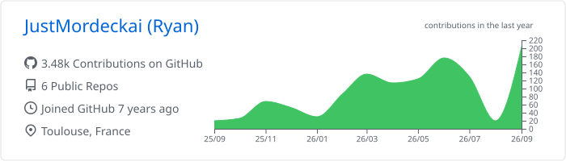
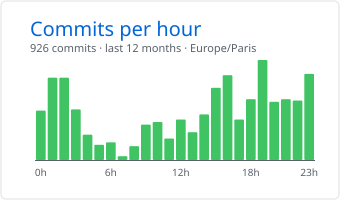

# 💫 About Me
🍁 I'm Ryan, I'm 22 and I'm from France 
💼 Working as a PHP developer on Symfony/Sylius 
🪐 MindCityRP community volunteer as Lead Dev and System Administrator

# 💻 Tech Stack

**Languages** 
        

**Frameworks & Front** 
                 

**Databases & Search** 
      

**Infra & DevOps** 
            

**Quality & Testing** 
        

**Gaming** 
 

**AI** 
     

**Tools** 
       

# 📊 GitHub Stats

<!-- Cartes générées chaque nuit par .github/workflows/profile-summary-cards.yml (repos privés inclus) -->
<picture>
  <source media="(prefers-color-scheme: dark)" srcset="./profile-summary-card-output/github_dark/0-profile-details.svg">
  
</picture>

<picture>
  <source media="(prefers-color-scheme: dark)" srcset="https://streak-stats.demolab.com/?user=JustMordeckai&theme=github-dark-blue&hide_border=true">
  
</picture>
<picture>
  <source media="(prefers-color-scheme: dark)" srcset="./stats/commit-hours-dark.svg">
  
</picture>
